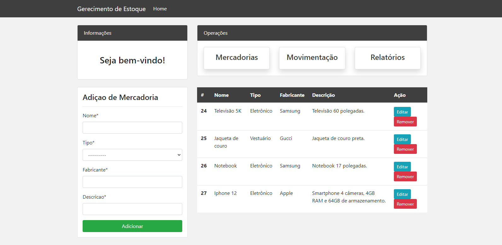
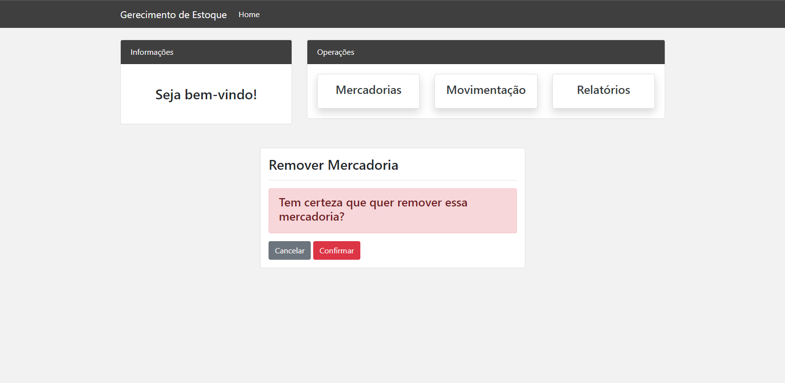
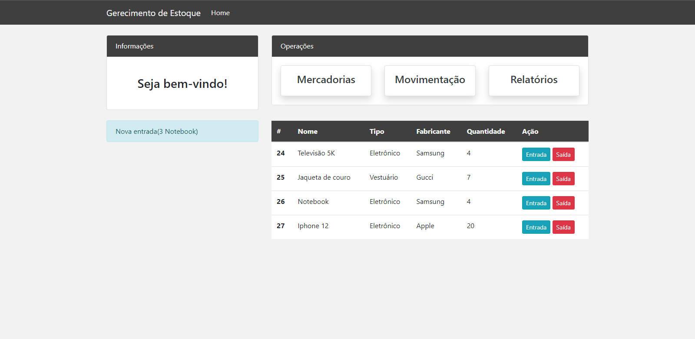
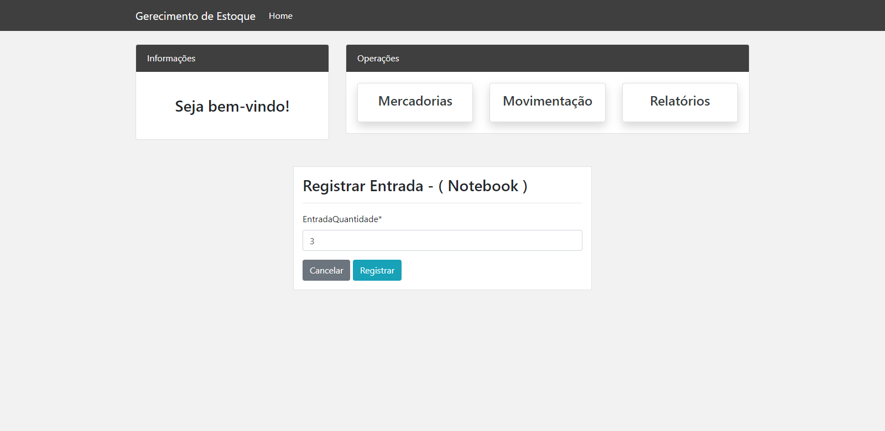
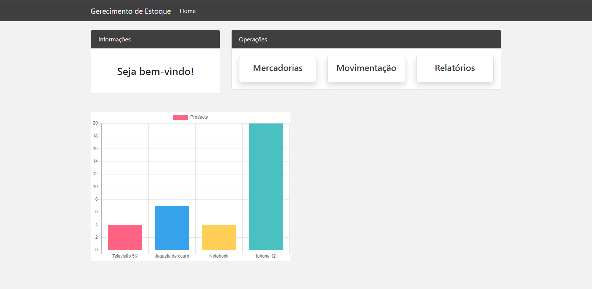

# Sistema de Gerenciamento de Mercadorias

O Sistema de Gerenciamento de Mercadorias é uma aplicação online desenvolvida para facilitar e otimizar o processo de gerenciamento de mercadorias em uma empresa de logística. 

## Funcionalidades Principais

1. **Cadastro de Mercadorias:** O sistema oferece uma interface para cadastrar informações detalhadas sobre os produtos, incluindo nome, descrição, tipo e fabricante.

2. **Registro de Entrada e Saída:** Através do sistema, é possível registrar as entradas e saídas de mercadorias.

3. **Exibição de gráfico:** É possível vizualizar um gráfico com todos os produtos atualmente em estoque e suas quantidades.

## Tecnologias Utilizadas

- **Linguagem de Programação:** Python.
- **Framework:** Django.
- **Banco de Dados:** SQLite, que é o banco de dados padrão do Django.
- **Frontend:** utilizei o Boostrap para auxiliar a criação da interface do sistema.

## Imagens

